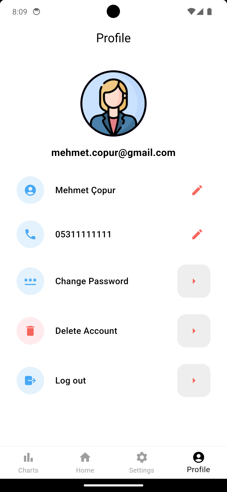

# ModMaster

ModMaster, Modbus TCP/IP protokolünü kullanan cihazlardan veri okuma ve yazma işlemleri gerçekleştiren Flutter tabanlı bir mobil uygulamadır.

  

## Contents

- [About the project](#about-the-project)
- [App Images](#app-images)
- [What is Modbus TCP Client ?](#what-is-modbus-tcp-client-)
- [Used Packages](#used-packages)

### About the project

Modbus TCP client, geliştirdiğimiz mobil uygulama üzerinden endüstriyel otomasyon sistemleriyle etkileşimde bulunan bir yazılım parçasıdır. ModMaster, kullanıcıya bu protokol üzerinden cihazlarla etkileşim kurma imkanı sunar. Ana sayfa, modbus register'ları görüntüler ve yeni veri eklemeye izin verir. Profil sayfasında Firebase Authentication entegrasyonu bulunurken, Settings sayfasında modbus bağlantı ayarları ve uygulama tercihleri düzenlenir. Chart sayfası, seçilen register'ın geçmiş verilerini grafikle gösterir. Kullanıcılar, endüstriyel otomasyonu kolayca mobil cihazları üzerinden yönetebilir ve uygulama aracılığıyla cihazlarla etkileşimde bulunabilir. Bu özellikler, README dosyasının kullanım kılavuzunda detaylı olarak açıklanmıştır.

### App Images

| Home Page | Chart Page | Connection Settings Page | Register Detail Page |
|-----------|-----------|-----------|-----------|
|  |  |  |  |

| Profile Page | Settings Page | Login Page | Register Page |
|-----------|-----------|-----------|-----------|
|  |  |  |  |

<!--
settings_page.png
connection_settings.png
| Register Detail Page | Login Page | Connection Settings Page |
|-----------|-----------|-----------|
|  |  |  | 
-->

### What is Modbus TCP Client ?

Modbus TCP client, endüstriyel otomasyon sistemlerinde kullanılan bir iletişim protokolünü uygulayan yazılım veya cihazdır. Temel görevi, endüstriyel cihazlar arasında veri transferi gerçekleştirmek ve kontrol sistemleri ile bu cihazlar arasında etkileşim sağlamaktır. Bu sayede Modbus TCP client, sensör değerlerini okuma, kontrol komutları gönderme, uzaktaki cihazları izleme ve kontrol etme gibi işlevleri yerine getirir. Ayrıca, endüstriyel otomasyon tesislerinde, fabrikalarda ve enerji sistemlerinde Modbus TCP protokolünü destekleyen cihazlarla iletişim kurarak uzaktan izleme, kontrol, veri toplama ve analiz görevlerini yerine getirir. Bu protokol ayrıca SCADA sistemleri tarafından da yaygın olarak kullanılır, bu da Modbus TCP client'ın SCADA ile endüstriyel tesislerdeki cihazlar arasında etkili bir bağlantı sağlamasını mümkün kılar.

### Used Packages
- [Flutter Riverpod](https://pub.dev/packages/flutter_riverpod)  
    
- [Modbus](https://pub.dev/packages/modbus)  
- [Flutter Localization](https://pub.dev/packages/flutter_localization)  
- [Flutter Secure Storage](https://pub.dev/packages/flutter_secure_storage)  
- [Cloud Firestore](https://pub.dev/packages/cloud_firestore)  
- [Graphic](https://pub.dev/packages/graphic)  
- [Firebase Core](https://pub.dev/packages/firebase_core)  
- [Firebase Auth](https://pub.dev/packages/firebase_auth){:target="_blank"}  

